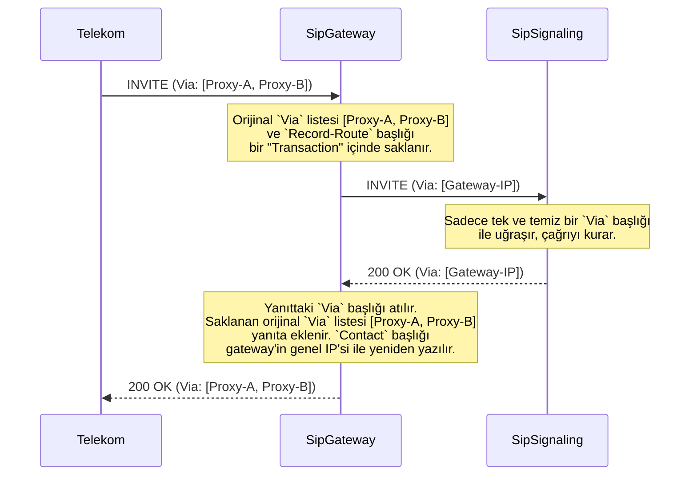

# 🛡️ Sentiric SIP Gateway Service - Mantık ve Akış Mimarisi

**Belge Amacı:** Bu doküman, `sip-gateway-service`'in Sentiric platformunun **"Dışişleri Bakanı"** olarak nasıl çalıştığını, gelen ve giden SIP trafiğini nasıl dönüştürdüğünü ve iç ağın karmaşıklığını nasıl gizlediğini açıklar.

---

## 1. Stratejik Rol: Ağ Sınırı ve Tercüman (SBC)

Bu servis, bir Oturum Sınır Denetleyicisi (SBC) gibi davranarak iki temel görevi yerine getirir:

1.  **Kalkan (Shield):** İç ağdaki `sip-signaling-service` gibi servisleri, dış dünyanın karmaşık ve bazen standart dışı SIP trafiğinden korur.
2.  **Tercüman (Translator):** Dış dünyadan gelen paketleri iç ağın anlayacağı basit bir formata, iç ağdan gelen basit paketleri ise dış dünyanın beklediği karmaşık ve standartlara tam uyumlu bir formata çevirir.

Bu mimari (`Strateji B+`), sorumlulukları net bir şekilde ayırır ve `sip-signaling-service`'in sadece çağrı orkestrasyonuna odaklanmasını sağlar.

## 2. Uçtan Uca Akış: Bir `INVITE` İsteğinin Dönüşümü

Aşağıdaki diyagram, servisin bir `INVITE` paketini nasıl işlediğini ve `Via` başlıklarını nasıl yönettiğini gösterir.

## 3. Kritik Başlık Yönetimi

-   **`Via` Başlığı:**
    -   **Gelen:** İstekteki tüm `Via` başlıkları saklanır. `signaling-service`'e gönderilen istekte bu başlıklar, gateway'in kendi tek `Via` başlığı ile değiştirilir.
    -   **Giden:** `signaling-service`'ten gelen yanıttaki `Via` başlığı atılır ve saklanan orijinal `Via` listesi yanıta eklenir.

-   **`Contact` Başlığı:**
    -   **Gelen:** Olduğu gibi saklanır.
    -   **Giden:** Yanıtlardaki `Contact` başlığı, gateway'in kendi genel IP adresini (`PUBLIC_IP`) içerecek şekilde yeniden yazılır. Bu, `ACK` gibi diyalog içi isteklerin doğrudan gateway'e gelmesini sağlar.

-   **`Record-Route` ve `Route` Başlıkları:**
    -   **Gelen:** `INVITE`'taki `Record-Route` başlığı saklanır.
    -   **Giden:** `signaling-service`'ten gelen `BYE` gibi diyalog içi istekler, saklanan `Record-Route` bilgisi kullanılarak bir `Route` başlığı eklenerek zenginleştirilir ve operatöre yönlendirilir.
