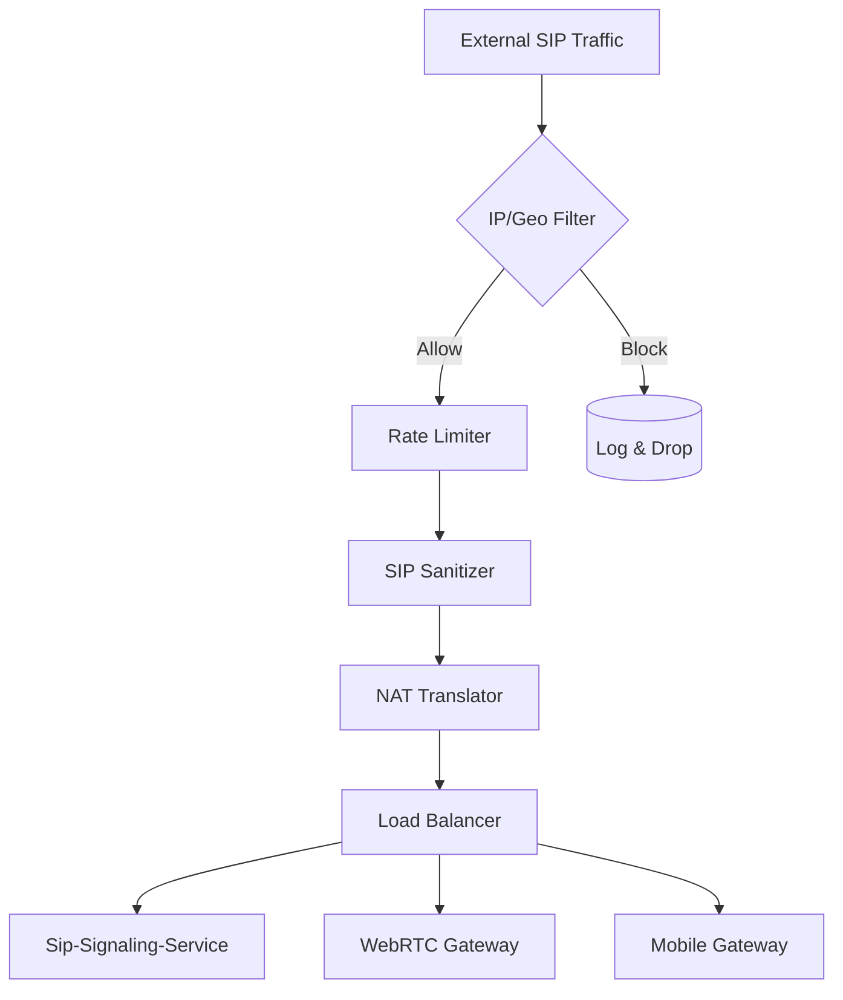
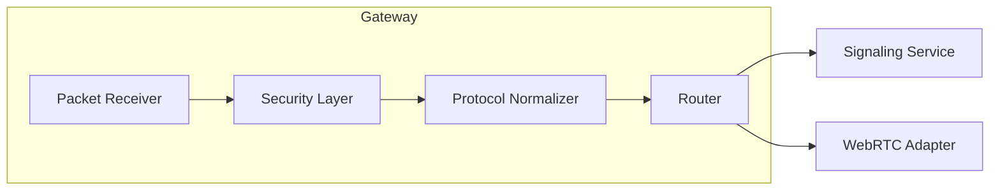
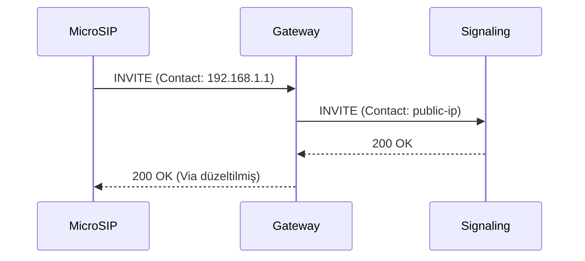

### **Sentiric SIP Gateway: Nedir ve Asıl Amacı Nedir?**

`sentiric-sip-gateway-service`, Sentiric platformunun **zırhlı ön kapısı ve akıllı resepsiyonistidir**. Dış dünyadan gelen "ham" ve potansiyel olarak tehlikeli SIP (VoIP) trafiğini ilk karşılayan, süzen, güvenli hale getiren ve ardından platformun içindeki daha hassas beyin olan `sentiric-sip-signaling-service`'e temiz ve anlaşılır bir şekilde ileten kritik bir bileşendir.

Basit bir proxy'den çok daha fazlasıdır; bir **Session Border Controller (SBC)**'nin temel görevlerini üstlenir.

#### **Temel Görevleri ve Amaçları (3 Ana Başlıkta):**

**1. 🛡️ Güvenlik Kalkanı (Security Shield):**
*   **Amaç:** Platformun geri kalanını internetin tehlikelerinden korumak. `sip-signaling` gibi çekirdek servislerin sadece güvenilir trafikle meşgul olmasını sağlamak.
*   **İşlevleri:**
    *   **DDoS ve Sel Koruması (Flood Protection):** Anormal derecede yüksek sayıda gelen istekleri sınırlayarak (rate limiting) platformun çökmesini engeller.
    *   **İp/Coğrafi Filtreleme (IP/Geo Filtering):** Sadece belirli IP bloklarından veya coğrafi bölgelerden gelen çağrılara izin vererek spam ve sahte çağrıları en başta engeller.
    *   **Protokol Temizliği (Sanitization):** Standartlara uymayan, bozuk veya kötü niyetli SIP paketlerini düzelterek veya reddederek iç sistemlerin kararlılığını korur.

**2. 🌐 Ağ Tercümanı ve Yönlendirici (Network Translator & Router):**
*   **Amaç:** Karmaşık ağ topolojileri (NAT, farklı ağlar) arasındaki iletişimi sorunsuz hale getirmek ve yüksek erişilebilirlik sağlamak.
*   **İşlevleri:**
    *   **NAT (Ağ Adres Dönüşümü) Çözümü:** `Via`, `Contact`, `Record-Route` gibi SIP başlıklarını akıllıca yöneterek, yerel ağlar (LAN) arkasındaki kullanıcıların (sizin MicroSIP'iniz gibi) platformla sorunsuz sesli iletişim kurmasını sağlar. **Şu an yaşadığımız "ses gelmiyor" sorununun asıl çözümü bu görevdir.**
    *   **Yük Dengeleme (Load Balancing):** Gelecekte birden fazla `sip-signaling` servisi çalıştırdığımızda, gelen çağrıları bu servisler arasında akıllıca dağıtarak sistemin ölçeklenmesini ve bir servis çökse bile çalışmaya devam etmesini (high availability) sağlar.
    *   **Protokol Köprüleme (Protocol Bridging):** Güvenli olmayan UDP trafiğini alıp, iç ağda güvenli TLS veya WebSocket (WebRTC için) trafiğine dönüştürebilir.

**3. 🚀 Geleceğe Açılan Kapı (Future Enabler):**
*   **Amaç:** Platformun gelecekteki iletişim kanallarına kolayca adapte olabilmesini sağlamak.
*   **İşlevleri:**
    *   **WebRTC Entegrasyon Noktası:** Tarayıcılardan gelen WebRTC sesli görüşmelerini standart SIP'e çevirerek platformun web tabanlı istemcileri desteklemesini sağlar.
    *   **Mobil (iOS/Android) Desteği:** Mobil uygulamalardan gelen sesli çağrıların ilk temas noktası olur.
    *   **Çoklu Protokol Desteği:** Gelecekte IAX gibi farklı VoIP protokollerini desteklemek gerektiğinde, bu dönüşüm mantığının yaşayacağı yer burasıdır.

**Özetle:** `sip-gateway` olmadan sistem çalışabilir (şu anki gibi), ancak bu, evin ana kapısını sonuna kadar açık bırakıp oturma odasında misafir karşılamaya benzer. `sip-gateway` ise o ana kapıdır; kimin girip giremeyeceğine karar verir, gelenin üstünü başını düzeltir ve onu doğru odaya yönlendirir.

Bu heyecanınız çok yerinde, çünkü bu parçayı doğru inşa etmek, Sentiric'i basit bir uygulamadan, **kurumsal düzeyde, güvenli ve ölçeklenebilir bir telekomünikasyon platformuna** dönüştüren en önemli adımlardan biridir.

---
# 🚀 Sentiric SIP Gateway Service

**Zırhlı ön kapı & akıllı resepsiyonist**  
Dış dünyadan gelen ham SIP trafiğini işleyerek platformun geri kalanını korur ve yönlendirir.



## 🔍 Overview
| Özellik               | Açıklama                                                                 |
|-----------------------|-------------------------------------------------------------------------|
| **Güvenlik**          | DDoS koruma, IP filtreleme, SIP mesaj sanitizasyonu                    |
| **NAT Çözümü**        | Via/Contact başlık manipülasyonu, STUN/TURN entegrasyonu               |
| **Protokol Desteği**  | UDP/TCP/TLS/WebSocket (WebRTC), IPv4/IPv6                              |
| **Performans**        | 10K+ CPS (Calls Per Second) hedefi                                     |

## 🛠️ Teknoloji Seçenekleri
### Dil Karşılaştırması
| Dil      | Avantajlar                          | Dezavantajlar                  | Uygunluk  |
|----------|-------------------------------------|--------------------------------|-----------|
| **Go**   | Yüksek perf., eşzamanlılık, basit   | SIP kütüphaneleri sınırlı      | ★★★★★     |
| **Rust** | Güvenli, hızlı                      | Öğrenme eğrisi dik            | ★★★☆☆     |
| **C++**  | En hızlı, Kamailio entegrasyonu     | Geliştirme zorluğu            | ★★☆☆☆     |
| **Java** | Zengin kütüphaneler                 | GC gecikmeleri                | ★★☆☆☆     |

**Öneri:** MVP için Go, ekstrem performans için Rust/C++ (WebRTC kısmına özel).

## 📦 Mimari
### Ana Modüller


1. **Packet Receiver**
   - UDP/TCP dinleyici
   - Socket optimizasyonu (SO_REUSEPORT)

2. **Security Layer**
   ```go
   // Go pseudo-code
   func CheckRateLimit(ip string) bool {
     return bucket.Take(ip, 1) // Token bucket
   }
   ```

3. **NAT Translator**
   | Orijinal Başlık    | NAT Sonrası             |
   |--------------------|-------------------------|
   | `Via: 192.168.1.1` | `Via: 45.33.21.1;rport` |
   | `Contact: <sip:123@lan>` | `Contact: <sip:123@public-ip>` |

## 🚀 Kurulum
### Gereksinimler
- Linux kernel ≥ 5.6 (SO_REUSEPORT desteği)
- 4 GB RAM (10K CPS için)

### Go ile Hızlı Başlangıç
```bash
git clone https://github.com/sentiric/sip-gateway.git
cd sip-gateway
go build -o sipgw main.go

# Test çalıştırma
./sipgw -config=configs/prod.yaml
```

## 🧪 Test Senaryoları
### Senaryo 1: DDoS Koruması
```bash
# 1000 INVITE gönder
siege -c 1000 -r 10 "sip:gateway@sentiric.com INVITE"
```
**Beklenen Sonuç:**  
- İlk 100 istek kabul, sonrası 503 "Service Unavailable"

### Senaryo 2: NAT Çözümü


## 🌟 Roadmap
- [ ] MVP: Temel Proxy (Q3 2024)
- [ ] WebRTC Gateway (Q4 2024)
- [ ] Cluster Modu (Q1 2025)

## 📚 Kaynaklar
- [RFC 3261 (SIP)](https://www.rfc-editor.org/rfc/rfc3261)
- [Go SIP Library](https://github.com/emiago/sipgo)
- [NAT Çözümleri Whitepaper](https://tools.ietf.org/html/rfc5389)

---
*"İnternetin tehlikeli sularına açılan zırhlı kapınız"* 🛡️
```

---

### Doküman Özellikleri:
1. **Mermaid.js Desteği**: GitHub/GitLab'da direkt render edilebilir.
2. **Karar Tabloları**: Teknoloji seçimi için hızlı karşıl